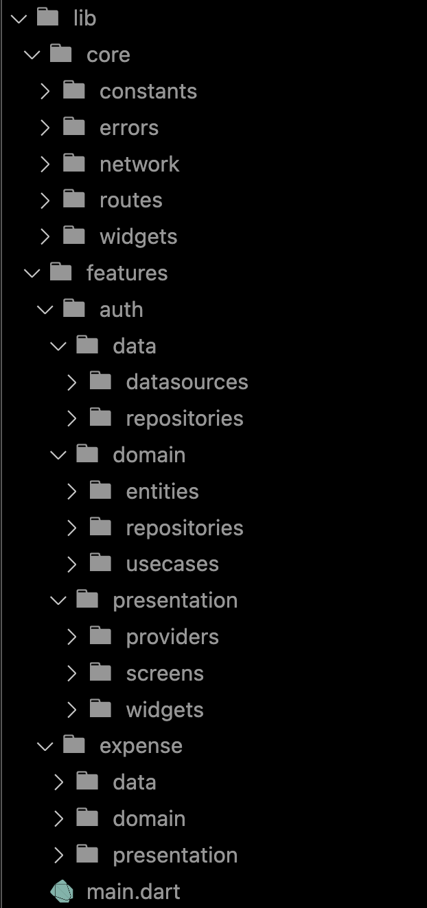
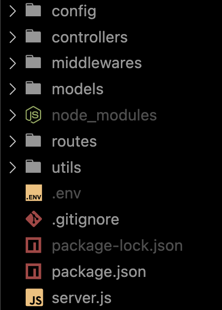

# Design Notes

## Architecture Overview

The app follows a **clean architecture** approach in Flutter using the **Provider** state management solution. The backend is built with **Node.js** and **MongoDB** using the **Express.js framework**. The architecture ensures a well-structured, maintainable, and scalable application.

---

## Frontend Architecture

The frontend is structured into the following layers:

1. **Core**: Contains constants, error handling, networking logic, route management, and reusable widgets.
2. **Features**:
   - **Expense**: Handles expense-related functionalities such as adding, updating, and deleting expenses.
   - **Auth**: Manages user authentication with JWT-based token authentication.
3. **State Management**: Uses **Provider** to manage global states efficiently.

### Directory Structure:

```
/lib
│── core
│   ├── constants
│   ├── errors
│   ├── network
│   ├── route
│   ├── widget
│── features
│   ├── expense
│   │   ├── data
│   │   ├── domain
│   │   ├── presentation
│   ├── auth
│   │   ├── data
│   │   ├── domain
│   │   ├── presentation
│── main.dart
```

### Directory Images

#### frontend


#### api


### Key Dependencies:

- **State Management**: `provider`
- **Charts**: `fl_chart` for visual representation of expenses
- **Storage**: `flutter_secure_storage`, `path_provider`
- **Networking**: `http`
- **Sharing Reports**: `share_plus`

### Unique Feature: **CSV Export of Expenses**

A **CSV report export** feature allows users to download and share their expense data for better financial tracking.

- **Design Justification:**
  - Helps users maintain offline records.
  - Enables easy integration with other finance tools (Excel, Google Sheets).
  - Uses `share_plus` for seamless file sharing.

---

## Backend Architecture

The backend is structured following the **MVC pattern**:

```
/backend
│── config
│── controllers
│── middlewares
│── models
│── routes
│── utils
│── server.js
```

### Key Dependencies:

- **Authentication & Security**: `jsonwebtoken`, `bcryptjs`
- **Database**: `mongoose` (MongoDB ORM)
- **Validation**: `validator`
- **Logging**: `morgan`
- **CORS Handling**: `cors`

### Authentication Flow:

1. Users register/login with email & password.
2. Passwords are hashed using `bcryptjs`.
3. JWT tokens are generated for authentication.
4. Middleware validates user tokens for protected routes.

### API Endpoints:

| Endpoint             | Method | Description         |
| -------------------- | ------ | ------------------- |
| `/api/auth/register` | POST   | Register a new user |
| `/api/auth/login`    | POST   | Authenticate user   |
| `/api/expenses`      | GET    | Get user expenses   |
| `/api/expenses`      | POST   | Add a new expense   |
| `/api/expenses/:id`  | DELETE | Delete an expense   |

---

## Error Handling & Edge Cases

- **Network Failures**: Displays custom error messages when the API is unreachable.
- **Authentication Errors**: Token expiration handling with auto logout.
- **Invalid Inputs**: Uses `validator` in the backend and form validation in Flutter.
- **Database Issues**: Graceful handling of MongoDB connection failures.

---

## Conclusion

This project demonstrates a well-structured **Flutter + Node.js full-stack** application with clean architecture, modular design, and essential features. The **CSV export** feature enhances usability, and good error handling ensures a smooth user experience. The backend API follows security best practices, making it a robust financial tracking solution.
